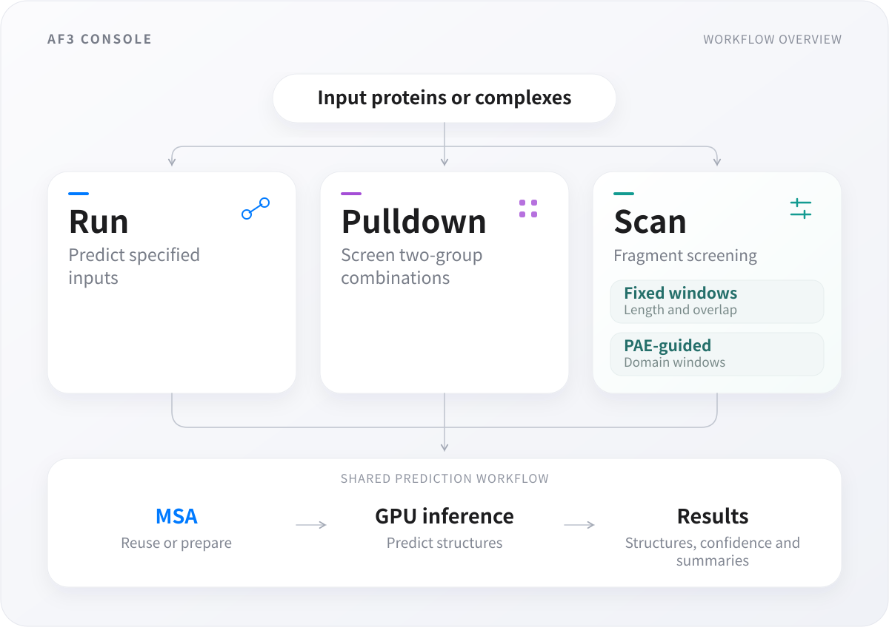
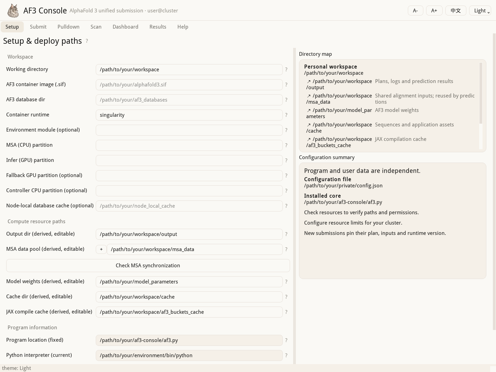

# AF3 Console

[Chinese](README.zh-CN.md) · [Usage](docs/usage.en.md) · [Input formats](docs/inputs.en.md) · [Feature comparison](docs/comparison.md)

Beyond AlphaFold 3–based batch interaction screening (Pulldown), AF3 Console introduces fragment scanning (Scan) for long proteins. Full-length predictions of very long sequences may fail to highlight local interaction signals; excluding candidates solely on a low overall ipTM score risks false negatives. Scan predicts fragments of a long protein against candidate partners and maps the results back to the original sequence coordinates. It aims to reduce missed interactions in full-length screening and locate regions for further investigation, informing truncation design and experimental validation.

Building on fixed-length sliding windows (Window Scan), the project introduces PAE Domain Windows to help reduce false positives caused by artificial truncation. Fixed windows can cut through a domain and disrupt its fold: for example, after a native β strand is removed, a fragment of another protein might occupy its place in a prediction, producing a high-scoring apparent interaction dependent on the truncation boundary. AF3 Console therefore reuses the domain-segmentation logic of ChimeraX **Color PAE Domains**. It groups residues with relatively well-determined positions with respect to one another, using PAE from a monomer prediction, into candidate structural units and constructs scanning fragments from them. This aims to preserve structural integrity and reduce arbitrary domain splitting without requiring existing domain annotations. The strategy provides a structural basis for fragmentation; whether it actually reduces false positives still requires systematic comparison and experimental validation.

A bilingual desktop and command-line workbench for preparing, submitting, monitoring and reviewing AlphaFold 3 workflows on Slurm clusters. Project author: **PKU-Gaolab, Ming-Ao Lu**.

## Workflows



Run predicts specified proteins or complexes; Pulldown screens combinations of two input groups; Scan screens fragment windows. Missing monomer PAE can require a preliminary monomer prediction. Stage selection, MSA reuse, 1–3 MSA pools and consent-based synchronization are covered in the [usage guide](docs/usage.en.md) and [MSA guide](docs/msa-pools.md).

## Install and start

Download **Code → Download ZIP** and unpack the software into a directory accessible to your cluster's login and compute nodes. From that directory:

```bash
conda env create -f environment.yml
conda activate af3-console
python -B install_command.py
af3_gui
```

Real predictions require **Linux + Slurm**, a separately obtained AF3 container, model parameters and databases, and a configured GPU partition. The GUI needs **X11 forwarding**. Complete [installation, configuration, first preview, submission, hardware reference and troubleshooting](docs/usage.en.md) instructions start from environment creation. The public `config.example.json` contains placeholders; keep your real configuration outside the repository.



Version **0.1.0 — pre-release**. [Linux CI](https://github.com/luckingclark/AF3-Console/actions/runs/35967066227): **191 tests passed, 0 skipped**. See the [validation record](docs/validation.md) for checks performed and remaining gaps. Real Slurm/AF3 execution, a fresh Linux Conda installation, GPU capacity and cross-cluster compatibility still require deployment validation. This repository does not distribute AF3, weights, databases or research datasets.

## Author, development and provenance

This project's code was developed through AI-assisted **vibe coding using Kimi-K3 and GPT-6**. Project author: **PKU-Gaolab, Ming-Ao Lu**. Report issues or propose focused changes after sanitizing logs and screenshots; development checks are documented in the [guide](docs/usage.en.md#development). 

The [feature comparison](docs/comparison.md) describes related tools by capabilities and focus, without ranking performance. PAE graph construction is adapted from the LGPL-licensed UCSF ChimeraX PAE implementation, which credits Tristan Croll/ISOLDE. Clustering and the mapped queue are adapted from NetworkX. See [algorithm provenance](docs/algorithm-provenance.md) and [third-party notices](THIRD_PARTY_NOTICES.md).

Original code and documentation: **MIT**, Copyright © 2026 PKU-Gaolab, Ming-Ao Lu. The PAE derivative remains **LGPL-2.1-only**, the NetworkX derivative **BSD-3-Clause**, and the bundled font retains its own terms. Complete notices are included in [LICENSE](LICENSE) and [LICENSES/](LICENSES/). AF3 Console is independent of Google DeepMind and UCSF ChimeraX; AF3 software and parameters remain subject to their own version-specific terms.

For software citation use [CITATION.cff](CITATION.cff) and record the actual commit/version used; no paper or DOI is claimed. Cite upstream methods as applicable. Citation does not replace license obligations.
