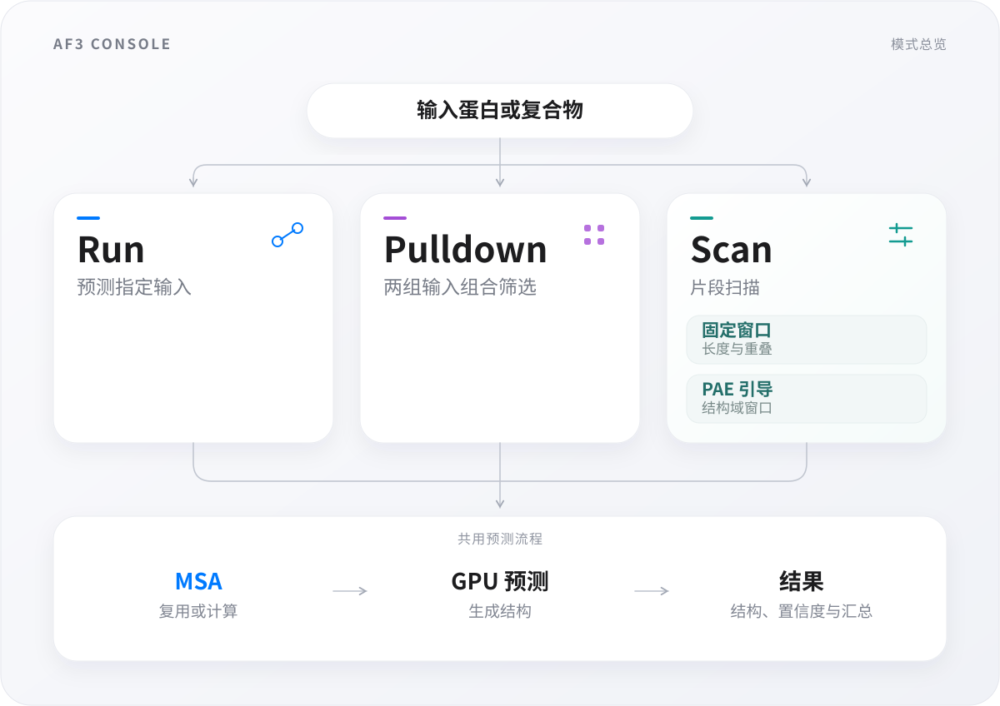

# AF3 Console

[English](../README.md) · [完整使用指南](usage.zh-CN.md) · [相关工具对比](comparison.zh-CN.md)

AF3 Console 是面向**在 Slurm 集群上使用 AlphaFold 3 的科研人员**的双语桌面与命令行工作台，整合输入准备、作业提交与监控，并汇总预测结构和互作筛选分数，便于查看结果。

**当前版本：0.1.0（预发布）。** `main` 是供用户配置后运行的部署版；[source 分支](https://github.com/luckingclark/AF3-Console/tree/source)保存可读 GUI 源码、测试与构建工具。

## 三种工作模式

### Run

根据表达式或 AF3 输入 JSON 预测指定蛋白或复合物，也可选择仅生成 MSA 或仅进行推理。

### Pulldown

批量筛选两组蛋白或复合物之间的组合，并汇总预测分数。

### Scan

使用固定滑动窗口（**Window Scan**）或单体 PAE 引导的窗口（**PAE Domain Window**）与候选伙伴逐一预测，并将分数映射回原序列坐标。

长蛋白的全长预测可能掩盖局部互作信号，仅凭整体 ipTM 低分排除候选，存在漏检风险。片段扫描旨在定位值得验证的区域，为截短体设计和实验验证提供依据。

固定窗口可能切断结构域，产生依赖截断边界的高分伪互作。PAE 结构域窗口借鉴 ChimeraX **Color PAE Domains**，依据单体 PAE 聚类残基并构造片段，尽量保留候选结构单元，无需现成的结构域注释；其降低假阳性的实际效果仍需系统比较和实验验证。



PAE 引导的扫描需要单体 PAE，缺少时可能需要额外运行单体预测。复合物、截短体及批量列表的写法见[输入规范](usage.zh-CN.md#输入规范)。预测分数及 PAE 划分的结构单元用于提出待验证的候选，不能作为结合的实验证据或已确认的结构域注释。

## 安装前需要什么

实际预测前，需要取得以下资源的使用权限：

- **Linux＋Slurm** 集群及 CPU、GPU 分区。提交检查需要 `sbatch`、`squeue` 和 `flock`。
- 单独取得的兼容 **AlphaFold 3 容器、模型参数和数据库**。生成的作业在容器内调用 `python /app/alphafold/run_alphafold.py`。默认容器运行时为 **Singularity**，可配置运行时命令及可选的 `module load`。
- 可写的工作目录，以及相关计算节点均能访问的资源路径。
- GUI 所需的 **X11 转发**；命令行入口不需要图形显示。

本仓库提供工作台，不包含 AF3 引擎、权重、数据库或课题数据。尚无这些资源时，请先向集群管理员确认部署位置与可用分区。

[environment.yml](../environment.yml) 声明了 **Python 3.12**、PySide6、NumPy、pandas、Matplotlib、six、python-dateutil、zstandard 和 qtawesome 及其版本范围。这些是工作台的依赖；创建该环境不会安装 AF3 预测引擎。

## 下载和安装

选择仓库的 **main** 分支，点击 **Code → Download ZIP** 并解压。

**只部署程序时可以精简：**将完整的 `AF3_Console/` 文件夹，加上**一个**环境文件（`environment.yml` 或 `environment_THUmirrors.yml`）上传到集群，环境文件与该文件夹放在同一级。保留 `AF3_Console/` 内全部内容，包括 `fonts/`、`LICENSES/` 和第三方声明。`docs/`、`.github/`、`.gitattributes`、`.gitignore` 和 `CITATION.cff` 不参与运行，说明文档和引用信息可在 GitHub 阅读。根目录 README 和 LICENSE 用于仓库说明；程序文件夹内已附适用许可证。整包下载同样可用，无需删除现有安装中的任何文件。

在包含环境文件和 `AF3_Console/` 的目录中，用 **Bash** 从默认源创建环境：

```bash
conda env create -f environment.yml
```

如果清华镜像更适合你的网络，可改用 [environment_THUmirrors.yml](../environment_THUmirrors.yml)，从**清华大学 TUNA 镜像**下载依赖。两个创建环境的命令**二选一**，不要重复执行：

```bash
conda env create -f environment_THUmirrors.yml
```

两份文件创建的环境都叫 `af3-console`，依赖版本约束相同。镜像文件使用 TUNA 的 conda-forge、bioconda 频道和 `nodefaults`，无需修改全局 `.condarc`；参见[清华镜像说明](https://mirrors.tuna.tsinghua.edu.cn/help/anaconda/)。镜像可用性及你所在集群的安装仍需验证；镜像不可用时可改用 `environment.yml`。已有可用环境的用户跳过创建，直接激活即可。

任选一种方式创建环境后，继续执行：

```bash
conda activate af3-console
cd AF3_Console
python -B af3.py install-gui
```

### 最小离线检查

保持上述环境已激活，并位于 `AF3_Console/` 目录，执行：

```bash
python -B af3.py --version
python -B -c "import af3; print(len(af3.parse_expression('P12345+Q12345', fetch=False)))"
```

预期输出：

```text
AF3 Console 0.1.0
2
```

`2` 表示表达式成功解析为两个蛋白条目。**P12345、Q12345 仅为语法占位示例。** 此检查不下载序列、不提交作业，也不生成预测文件；它验证命令行入口和表达式解析，不代表 AF3 资源或集群运行已经通过验证。

### 打开界面

上面的一次性注册显示 `Installed: .../bin/af3_gui` 即表示成功。之后包括新开的 SSH 会话，在**任意目录**激活环境即可启动：

```bash
conda activate af3-console
af3_gui
```

请保留程序目录；搬动后，在新程序目录重新执行一次 `python -B af3.py install-gui`。无需单独的安装脚本或管理员权限。

此阶段的成功标志是主窗口打开，能够访问**设置**及**帮助 → 关于**；AF3 资源可以随后填写。若无法打开图形显示，请检查 X11 转发，参见[使用指南](usage.zh-CN.md)。

## 集群无法连接 UniProt 时使用离线序列库

抓取序列时若出现 `Name or service not known` 或 `Resolving timed out`，可在能联网的电脑上下载[四物种离线序列库](https://github.com/luckingclark/AF3-Console/releases/tag/uniprot-4species-20260930-isoform-fix)并传到集群。修正版 ZIP 约 **58 MB**，包含大肠杆菌 K-12 MG1655、人、小鼠、酿酒酵母 S288C 共 **243,492 条序列**，以及 **15,904 条官方 canonical isoform 映射**，数据版本为 UniProt **2026_03**。

将包内的 `uniprot/` 放到**应用缓存目录**下，默认索引位置是 `~/AF3/cache/uniprot/uniprot.sqlite3`，保留已有 `.seq` 文件。实验室可在设置页指定一份只读共享库；已支持离线库的程序只需更新数据，不用重装 Conda。详见[安装、校验、共享与成功标志](usage.zh-CN.md#uniprot-离线序列与共享序列库)。数据包为可选下载，与仓库 ZIP 分开提供，不包含 MSA 结果、AF3 搜索数据库或权重；UniProt 数据保留 **CC BY 4.0** 署名条款。

## 配置并完成第一次预测

1. 已有配置 JSON 时，在**设置**中点击**导入配置 JSON**，再按自己的账号修改；也可手动填写。设置工作目录（默认 `~/AF3`）、AF3 容器文件、模型参数目录、数据库目录，以及实际可用的 CPU／GPU 分区。使用真实集群路径，不要保留 `/path/to/your/...` 占位符。[config.example.json](../AF3_Console/config.example.json)用于说明字段，并非可直接提交作业的集群配置。
2. 点击**检测资源**，解决提示的问题后保存。导入配置会保存为个人默认设置，下次自动读取，不会将模板选为保存位置。个人设置通常写入 `~/.config/af3_console/config.json`。`AF3_CONFIG` 可指定其他配置文件，`AF3_BASE` 可覆盖工作目录；无需 `.env` 文件。优先级详见[配置说明](usage.zh-CN.md#precedence-and-persistence)。
3. 从 **Run** 和你自己的小规模输入开始。预测两蛋白复合物时，用 `+` 连接两个实际 UniProt ID；也可按[输入规范](usage.zh-CN.md#输入规范)提供 AF3 输入 JSON。UniProt 表达式可能需要联网获取序列。
4. 先**预览**，核对任务数量、运行阶段和 seeds。预览／CLI `--dry-run` 不提交作业，但可能获取序列及检查缓存，不一定是离线操作。
5. **提交**后在仪表盘查看任务状态。Slurm 作业编号仅表示提交成功；完整预测还需确认任务完成，并检查下文的结构和置信度文件。

批量输入、扫描设置、CLI 命令以及 CPU／A40／A100 的资源参考见[完整指南](usage.zh-CN.md)。资源上限是配置选项，不代表已经验证某个 token 数必定不会导致 GPU 显存不足。

### 复用与备份 MSA

设置支持 **1–3 个 MSA 池目录**。新产出的 MSA 会复制到配置的池中；每次 GUI 启动时，检测到新增内容可由用户确认后同步。同步只补充缺失文件，不删除已有数据，也不覆盖冲突文件。权限不足或目标目录不可用可能导致备份未完成，请查看操作结果。

保留 AF3 原生目录，包括 `P12345_20260602_140829/P12345_data.json` 这样的时间戳目录。不完整的 MSA 数据会被拒绝复用；合法但为空的 `unpairedMsa`、`pairedMsa` 或 `templates: []` 会提示选择复用、重算或取消。具体检查范围和限制见 [MSA 说明](usage.zh-CN.md#msa-pools)。

## 在哪里找结果，怎样确认成功

下表使用默认工作目录；配置可改变路径，实际以提交任务记录的位置为准。

| 位置或文件 | 用途与成功标志 |
|---|---|
| `~/AF3/output/` | 任务计划、状态、日志及预测结果。在仪表盘查看对应任务目录；`spec.json`／`plan.json` 表示任务计划，不代表推理已完成。 |
| `~/AF3/msa_data/` | 可复用的 MSA，例如 `P12345/P12345_data.json`。仅 MSA 任务应检查该阶段完成及数据生成，不会产出结构。 |
| `*_model.cif`、`*_summary_confidences.json` | 结果查看器使用的 AF3 结构及置信度摘要。完整预测应确认预期任务成功，且这些结果可以打开；目录层级取决于 AF3 引擎和任务。 |
| `ranking.csv`、`results_index.json` | Pulldown／Scan 的分数汇总与结果索引。解释排名前先检查任务状态和缺失结果。 |
| `iptm_profile.csv`、`report.md` | Scan 的附加汇总，用于沿原始序列坐标查看分数。 |

缺少结果、存在失败任务或仅有部分排名，都不能视为整批筛选完成。结果获取和后续操作见[结果与升级说明](usage.zh-CN.md#结果升级与故障处理)。

## 作者、许可与引用

项目作者：**PKU-Gaolab, Ming-Ao Lu**。本项目代码利用 **Kimi-K3 和 GPT-6**，通过 AI 辅助的 **vibe coding** 方式完成。反馈问题前请先脱敏日志和截图；可读源码与开发检查位于 [source 分支](https://github.com/luckingclark/AF3-Console/tree/source)。

- 原创代码和文档采用 **MIT**，见 [LICENSE](../LICENSE)。
- `af3_pae_domains.py` 采用 **LGPL-2.1-only**，改编自 UCSF ChimeraX **Color PAE Domains** 实现，并保留对 Tristan Croll／ISOLDE 的来源归功。
- `af3_networkx_community.py` 采用 **BSD-3-Clause**，改编自 NetworkX 的聚类与映射队列代码。
- 随附字体保留自身条款。完整第三方说明和许可证见 [THIRD_PARTY_NOTICES.md](../AF3_Console/THIRD_PARTY_NOTICES.md) 及 [LICENSES/](../AF3_Console/LICENSES/)，也可从帮助 → 关于离线访问。

具体来源与修改见[算法来源](https://github.com/luckingclark/AF3-Console/blob/03c29106fd23b20928c9591b35b22b2508c9adfd/docs/algorithm-provenance.md)。本项目与 Google DeepMind、UCSF ChimeraX 无官方隶属关系；单独取得的 AF3 软件、参数和数据库适用各自条款。

软件引用见 [CITATION.cff](../CITATION.cff)，请记录实际使用的 commit／版本。本项目没有声称关联论文或 DOI。按使用情况引用上游方法；引用不能代替许可义务。
