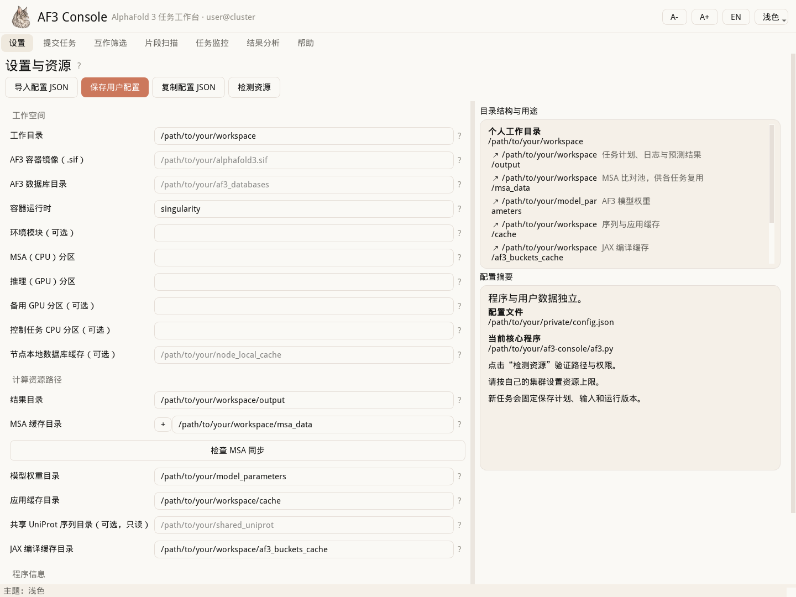

# AF3 Console 使用指南

[English](usage.en.md) · [首页](../README.zh-CN.md) · [输入规范](inputs.zh-CN.md)

除明确要求切换目录外，下列命令均在解压后的软件目录执行。安装从创建 Conda 环境开始，之后再配置集群资源。

## 安装前需要什么

实际预测需要已有的 **Linux Slurm 集群、AF3 Singularity 容器、模型参数、数据库以及 GPU 资源**。程序、Python 环境和工作目录必须能被计算节点访问。桌面窗口通过 X11 转发显示。

这个仓库提供 UI 和调度脚本，不包含 AF3 引擎、模型参数、数据库、GPU 驱动或完整 Python 环境。打开界面、阅读帮助不需要配置完整集群；正式提交前会检查资源。不同集群和旧版 Linux 的兼容性须分别验证，详见[验收记录](validation.md)。

## 功能与定位

- 表达式或原生 AF3 JSON 输入；完整流程、仅 MSA、仅推理。
- 两组蛋白或复合物的组合筛选；固定窗口或 PAE 引导的片段扫描。
- 复用兼容 MSA；保存输入、种子、代码与配置快照。
- 查看任务状态、从已完成 MSA 继续推理、重试失败任务。
- 查看排名、指定接口置信度、PAE 和报告；界面支持中文/英文、浅色/深色。



本项目的价值在于集成工作流和桌面操作体验。PAE 分域不是本项目首创；预测置信度和分域结果也不是互作或结构域的实验证明。

## 下载和安装

在仓库点击 **Code → Download ZIP** 下载源码，或在正式发布后从 **Releases** 下载精简运行包。解压到登录节点和计算节点都能访问的目录。精简包只是减少开发文件，仍需自行安装 Python 依赖。

在解压目录中执行：

```bash
conda env create -f environment.yml
conda activate af3-console
python -B af3.py --version
python -B install_command.py
```

也可以使用系统支持的 Python 3.12：

```bash
python -m venv /path/to/your/af3-console-env
source /path/to/your/af3-console-env/bin/activate
python -m pip install -r requirements.txt
python -B install_command.py
```

集群优先采用 Conda。仓库声明依赖范围，不分发开发者完整环境或私人软件源地址；实际验证的依赖版本记录在验收文档中。

安装脚本会将 `af3_gui` 注册到当前 Conda 环境（或 venv）。在包含 `af3_gui` 的程序目录运行一次即可；以后激活该环境，就能在任意目录输入 `af3_gui`。启动时保留当前目录，并使用该环境的 Python；无需修改 `.bashrc`，也不需要管理员权限。同名的其他程序不会被覆盖。

搬动或升级程序后，在新程序目录重新执行 `python -B install_command.py` 更新命令。程序目录和环境仍需对计算节点可见；尚有排队或运行作业引用旧安装时，不要删除旧目录。若 Bash 缓存了旧命令，可执行 `hash -r`；`command -v af3_gui` 应显示当前环境下的 `bin/af3_gui`。

## 配置资源

### 在界面中导入已有配置（推荐）

如果同事提供了配置 JSON，先将文件上传到自己的集群账号，再正常启动 GUI。在设置页点击 **导入配置 JSON**，选中文件后修改自己的工作目录及其他项目，点击 **检测资源**，最后点击 **保存用户配置**。

导入只填入设置，不立即写文件。保存会写入个人默认位置 `~/.config/af3_console/config.json`；若该文件已存在，会先保留一份带 `before-import` 标记的备份。模板文件不会被选为保存位置。导入的 MSA 线程数、编译桶等未显示在表单中的参数也会保留；不认识的字段或无效值会报错，不会静默丢弃。

完成一次后，下次正常启动 GUI 会自动读取个人设置，无需再次导入或设置 `AF3_CONFIG`。保存导入配置时，当前 GUI 及其后续子进程会切换到个人默认配置；已提交任务仍使用各自快照。若曾在 `.bashrc` 等启动文件或启动脚本中设置 `AF3_CONFIG`／`AF3_BASE`，需一次性移除这些覆盖项；程序不会替你修改 shell 文件。

### 手动配置（可选）

可以直接在 GUI 设置页填写，也可复制模板：

```bash
mkdir -p ~/.config/af3_console
cp config.example.json ~/.config/af3_console/config.json
```

随后编辑用户配置，将所有 `your_...` 和 `/path/to/your/...` 替换成自己的资源。模板中的占位值不能直接运行。

| 配置 | 应填写什么 |
|---|---|
| `HOST_SIF` | AF3 的 `.sif` 容器文件 |
| `HOST_MODELS` | 模型参数所在目录 |
| `HOST_DB_SOURCE` | AF3 数据库根目录 |
| `HOST_BASE` | 个人工作目录，默认 `~/AF3` |
| `MSA_PARTITION` / `INF_PARTITION` | 实际 CPU / GPU Slurm 分区 |
| `CONTAINER_MODULE` | 可选的环境模块名；运行命令已在 PATH 中时留空 |

SSD 缓存和备用 GPU 分区默认关闭。设置保存到用户 JSON，不修改源码；个人配置不可提交到 GitHub。更多路径、环境变量和优先级见[配置说明](configuration.md)。

**MSA 池与备份：** 点击 MSA 缓存路径左侧的 **＋**，可配置 1–3 个独立目录。新产物完成后复制到各备份池；每次启动检查一次各池新增内容，询问后才互相同步。同名冲突保留双方数据，不覆盖、不删除。复用前校验完整性；合法但 `unpairedMsa`、`pairedMsa` 或 `templates` 为空时，提示选择复用、重新计算或取消。详见 [MSA 备份、同步与空字段处理](msa-pools.md)。

### “资源上限”的硬件配置参考

以下是开发环境的硬件与既有配置参考，硬件信息由项目作者于 **2026-09-14** 提供，不代表公开版本已在这些节点上重新验收。CPU 型号未提供，仅列调度器报告的拓扑与内存；不公开账号、节点名、分区名或部署路径。

| 资源 | 节点规格 | 既有配置的用法 |
|---|---|---|
| CPU 节点 | 2 插槽 × 24 核，每核 1 线程，共 48 CPU；Slurm `RealMemory=510000 MB` | 小批 MSA（任务数 < 6）：`MSA_NTASKS_SINGLE=16`；批量（≥ 6）：`MSA_NTASKS_BATCH=8`。 |
| A40 节点 | 每节点 4 × NVIDIA A40；每卡 `nvidia-smi` 报告总显存 **46,068 MiB** | 将 A40 所在分区配置为主 GPU 分区；总 token **≤ 3,584** 时默认投这里。 |
| A100 节点 | 每节点 8 × NVIDIA A100 80GB PCIe；每卡总显存 **81,920 MiB** | 将 A100 所在分区配置为备用 GPU 分区；总 token **> 3,584 且 ≤ 7,168** 时默认投这里。 |

上表描述自动选择分区的情况；手动指定分区会覆盖自动选择，备用分区留空也不会自动转到 A100。程序按分区提交，并不检测 GPU 型号；分区中若混有不同型号，需要自行核实调度结果。每个推理作业的既有配置是 **1 张 GPU＋12 CPU**（`INF_GPUS=1`、`INF_NTASKS=12`），节点上 4／8 张卡的显存不会在本程序中合并给一个任务使用。

| 总 token 范围 | 既有推理策略 |
|---|---|
| ≤ 3,584 | A40，常规显存配置。 |
| 3,585–5,120 | A100 80GB，常规显存配置。 |
| 5,121–7,168 | A100 80GB，启用 unified memory（统一内存），允许使用 GPU 节点的主机内存；需要足够的主机内存和作业内存配额。 |
| > 7,168 | 在提交前拒绝，属于当前配置的保护上限。 |

对应设置为 `INF_BIG_TOKEN=3584`、`INF_UM_TOKEN=5120`、`INF_MAX_TOKEN=7168`，编译桶最大为 7,168。这里统计的是整个任务所有实体及副本的 token；纯标准蛋白时近似为各链残基数之和，混合实体时以实际分词为准。界面预估与编译桶填充也会影响容量判断。

**关于 OOM：**历史开发代码的注释记录过 **A100 80GB＋统一内存，在 7,680 token 的编译桶发生 OOM**，因此既有配置把上限设为 7,168。本轮未取得该次原始日志，也未重新运行该测试，不能据此认定所有超过 7,168 的输入必然 OOM，或低于它的输入必然成功；3,584 同样是 A40→A100 的调度阈值，并非测定的 A40 物理极限。5,120 的常规显存设置及统一内存机制可参考 [AF3 v3.0.2 官方说明](https://github.com/google-deepmind/alphafold3/blob/v3.0.2/docs/performance.md#gpu-memory)，容量仍受实际 AF3／JAX／CUDA 版本、桶配置和 GPU 节点内存影响。上表的 CPU 节点内存不能用来推断 GPU 节点内存。

**MSA 线程与并发：**当前脚本把 16／8 同时用于 Slurm 申请的 CPU 数和每个 Jackhmmer／Nhmmer 搜索进程的线程参数。AF3 的蛋白 MSA 可同时搜索 4 个数据库，所以每进程 16 线程并不代表整个作业只产生 16 个计算线程；现有配置可能出现线程超订阅。这些数值用于说明开发配置，不是 48 核节点的最优设置。严格匹配总 CPU 配额与各搜索进程线程，需要进一步拆分配置和调整脚本。[AF3 数据流水线说明](https://github.com/google-deepmind/alphafold3/blob/v3.0.2/docs/performance.md#data-pipeline)

原配置的 `MSA_MAX_CONCURRENT=12`、`INF_MAX_CONCURRENT=16` 是批次的调度并发上限，不是每节点线程数或卡数，也不保证有相应空闲资源；资源不足时由 Slurm 排队。其他集群可先从并发 1 的小任务验证，再结合 CPU、内存、GPU 和配额调整。MSA 线程、统一内存阈值和桶表等未出现在“资源上限”折叠栏中的项，可在个人 JSON 中设置；保留公开的 `config.example.json` 占位模板，把含实际路径和分区的实验室配置另存于仓库外。

## 打开界面

在 MobaXterm 中开启 X server 和 X11 转发，或使用：

```bash
ssh -X your_username@your_login_host
conda activate af3-console
cd /path/to/your/af3-console
af3_gui
```

在“设置”页检查资源、修正问题并保存。纯命令行帮助不要求 X11。

## 第一次预览与提交

`af3_gui` 可在任意目录启动；下方 `python -B af3.py ...` 命令行示例仍需在包含 `af3.py` 的程序目录执行。

下面所有 `P12345`、`Q12345` 都是**语法占位符**，没有指定生物学对象，也不保证长度或突变位点有效。正式使用前替换为自己的输入：

```bash
python -B af3.py run 'P12345+Q12345' --seeds 11 --dry-run
python -B af3.py run 'P12345' --msa-only
python -B af3.py pulldown 'P12345' 'Q12345' --seeds 11
python -B af3.py scan 'P12345' 'Q12345' --mode win --win 300 --overlap 100
python -B af3.py scan 'P12345' 'Q12345' --mode pae
```

`--dry-run` 不提交作业，但可能联网解析 UniProt。确认配置、输入和预览后，去掉它才会提交。GUI 对应“提交 → 预览”，检查后再提交。PAE 扫描缺少全长单体结果时可能先提交单体预测；大批量筛选前请检查任务数量和资源要求。

```bash
python -B af3.py status --jobs /path/to/your/batch/spec.json --json
python -B af3.py continue --spec /path/to/your/batch/spec.json
python -B af3.py retry --spec /path/to/your/batch/spec.json
```

更多文件输入示例见 [输入规范](inputs.zh-CN.md)，完整参数说明见 UI 帮助页。

## 模式流程图

**Run** 预测指定的蛋白或复合物；**Pulldown** 筛选两组输入的组合；**Scan** 先按固定窗口或 PAE 引导生成片段，再筛选片段组合。


图示为完整预测流程。PAE 模式缺少所需的全长单体 PAE 时，会先补算单体预测；阶段选择与 MSA 策略详见 UI 帮助。

## 结果、升级与故障处理

### 从最初的 GitHub 版本升级到当前启动方式

已核对最初 GitHub 源码快照 `03c29106fd23b20928c9591b35b22b2508c9adfd`：六个计算／运行支持模块和字体与当前版本一致。本次只需从最新 main 的 `AF3_Console/` 中取得：

| 文件 | 操作与用途 |
|---|---|
| `af3_gui` | 替换旧文件，获得设置页导入配置等界面更新。 |
| `install_command.py` | 新增文件，用于安装环境内的 `af3_gui` 命令。 |

将这两个文件放到现有 `af3.py` 所在的同一目录。最初仓库版本的脚本可能在解压根目录，不必为了升级强制搬动已有目录。关闭旧 GUI，保留旧 `af3_gui` 副本后再替换；不要删除配置、任务快照、MSA、模型、数据库或许可证。

在该程序目录激活原来的 `af3-console` 环境，运行一次 `python -B install_command.py`；此后从任意目录执行 `af3_gui`。依赖声明没有变化，已有可用环境无需重建。只想更新说明时，可另外查看新版 README 和本指南。

此两文件更新适用于**最初上传 GitHub 的版本**。如果手上是更早的 **9 月 12 日五文件 ZIP**，请下载完整 main，因为它缺少目前所需的独立模块及许可证。

默认批次输出在 `~/AF3/output/`，共享 MSA 池在 `~/AF3/msa_data/`，全长推理池在 `~/AF3/infer_data/`。结果保存在集群；复制界面显示的目录后，用 SFTP 下载。关闭窗口不会取消已提交的 Slurm 作业。

新建的普通 UniProt MSA 按每个蛋白的 ID 命名，与用户填写的 run 任务名或 pulldown／scan 批次名无关，并保留 AF3 原生目录，例如（ID 仅为语法占位符）：

```text
msa_data/
└── P12345/
    └── P12345_data.json
```

程序不再把 JSON 移到池根目录，也不删除 AF3 的输出子目录和附带文件。同一 ID 的序列、外部 MSA 或已记录的计算环境不同，或者名称过长需要缩短时，会使用 `P12345__<hash>/P12345__<hash>_data.json` 等名称防止混用；截短和突变也会体现在名称中。匿名序列仍按内容命名。旧的根目录 JSON 和哈希缓存保持原样：匹配旧哈希身份的缓存可原地复用；普通输入也可在 JSON 完整性和序列校验通过后复用无管理记录的旧 ID 缓存，但其历史容器／数据库环境无法由文件名确定。外部 MSA、MSA-free 等特殊输入单独区分。

pulldown 中每个普通 UniProt 输入分别生成自己的 MSA。scan 开启共享全长 MSA 时，原始全长 MSA 也分别以 ID 命名；片段复用数据包含截短范围等标识。scan 未开启共享全长 MSA 时，独立计算的片段 MSA 同样需要范围标识，不能全部命名为同一个全长 ID。

同样兼容单个 UniProt ID 对应的 AF3 时间戳目录：仅目录名添加时间戳，JSON 仍以该 ID 命名：

```text
msa_data/
└── P12345_20260602_140829/
    └── P12345_data.json
```

没有管理记录时，按目录名中的时间戳从新到旧选择校验通过的结果，再尝试无时间戳原生目录和旧平铺文件。自动按 ID 查找时，目录的 ID 前缀与 JSON 的 ID 应一致。多个结果需要指定某一次时，直接选择其目录或 JSON；已有 MSA JSON 可这样用于推理：

```bash
python -B af3.py run --infer-only --json /path/to/your/msa_data/P12345_20260602_140829/P12345_data.json
```

历史输出也可以使用自定义 job 名；名称中的 `_and_` 等文字不用于判断输入个数，实际输入以 JSON 内容为准。自定义名称或目录前缀与文件名不一致时，可显式选择已有 JSON。保留或复制完整 AF3 输出目录即可，伴随文件及相对引用无需拆开整理。

池中的 `.msa_records/` 保存输入身份与完成状态，`.locks/` 协调写入。新作业只有成功退出且产物校验通过才算 MSA 就绪；失败文件保留但不会作为完成结果使用。复制整个池时保留这些记录，不要通过删除记录来强行复用。旧任务快照继续使用各自原来的存储逻辑，新目录行为用于新版创建的任务。

升级时将新版放在新目录，保留个人配置。不要移动或删除仍被排队/运行作业引用的安装目录、Python 环境和任务快照；不要手动改写已固定的计划。缓存身份变化可能需要重新计算。

| 问题 | 检查方向 |
|---|---|
| 没有窗口、`DISPLAY` 为空 | X11 转发和本地 X server |
| Qt xcb/platform plugin 错误 | 当前 Qt 所需的 Linux 系统库 |
| 资源检查失败 | 占位配置、路径权限、分区名、计算节点可见性 |
| 容器需要 module 才能使用 | 填写 `CONTAINER_MODULE` |
| 保存设置后未生效 | `AF3_CONFIG` / `AF3_BASE` 是否覆盖当前值 |
| OOM 或 token 超限 | GPU 容量和配置的阈值；没有通用安全上限 |
| 有输出文件夹却显示失败 | 退出回执和日志；目录存在不代表任务成功 |

反馈问题前，请删除日志和截图中的课题目标、序列、未公开结果、账号、主机、私人路径及凭据。

## 开发与反馈

问题反馈与修改建议通过 Issues／Pull requests 提交。请先删除日志、截图中的课题名称、序列、未公开结果、私人路径和凭据。精简运行包不包含测试和构建工具，开发请使用源码。

完成上述环境安装后执行：

```bash
python -m pip install -r requirements-dev.txt
python -B merge_gui.py
python -B -m unittest discover -s tests -v
python -B packaging/audit_release.py
python -B packaging/build_workflow_diagram.py --check
```

修改可读 GUI 模块后重新生成 `af3_gui`，不要直接编辑其压缩内容。中英文帮助应同步更新；测试仅使用临时目录、人工输入与模拟调度，不在 CI 中提交真实作业。流程图的中英文 Mermaid 源文件位于 `docs/images/`；执行 `python -B packaging/build_workflow_diagram.py` 重新生成 SVG，图结构变化时还需调整生成脚本中的布局。

原创贡献采用 MIT；PAE 和 NetworkX 衍生模块继续保留各自的 LGPL-2.1-only 和 BSD-3-Clause 许可及上游通知，详见[第三方声明](../THIRD_PARTY_NOTICES.md)。修改科学算法需要独立的预期结果和影响说明。发现误提交的敏感信息时，不要在公开 Issue 中重复发布。
